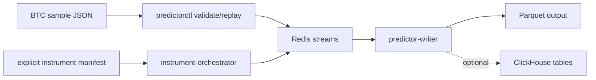

# Go Predictor Learning Implementation

This module is a side-by-side Go implementation of the predictor sample replay
pipeline. The Python predictor in `../predictor` remains unchanged.

The first slice is deliberately deterministic: it validates and replays the BTC
raw and normalized sample files before live exchange websocket adapters are
added. That makes the data contract testable with `go test ./...` and no
external services.

## What It Teaches

The code reuses lessons already present in this repository:

- structs and JSON tags from `basics/10-Struct`
- interfaces from `basics/11-Interfaces`
- goroutines, channels, and cancellation from `basics/13-Concurrency`
- explicit errors from `basics/14-Error-Handling`
- file loading from `basics/15-Files-Directory`
- tests from `basics/18-Testing`
- health endpoints from `basics/19-Webserver`
- websocket boundaries from `advanced-programs/WebsocketsChat`
- Prometheus metrics from `advanced-programs/PrometheusHTTPServer`
- package layout and config-driven commands from `vehicle-lifecycle`

## Architecture



## Commands

```bash
cd advanced-programs/predictor-go
go test ./...
go run ./cmd/predictorctl validate-samples
go run ./cmd/predictorctl replay-samples -sink stdout
go run ./cmd/instrument-orchestrator -config configs/btc-instruments.sample.json
```

Run the local service stack:

```bash
docker compose up --build redis clickhouse instrument-orchestrator sample-replay predictor-writer
```

Run unit tests in Docker:

```bash
docker compose --profile test run --rm unit-tests
```

Run opt-in integration tests against the Compose services:

```bash
docker compose up -d redis clickhouse
PREDICTOR_INTEGRATION=1 go test -tags=integration ./...
```

## Data Contracts

Redis streams:

- `orderbook.raw.v1`
- `orderbook.normalized.v1`

ClickHouse tables:

- `orderbooks.raw_orderbook_payloads`
- `orderbooks.normalized_orderbook_snapshots`

The normalized table is extended in place with:

```text
stream_id, product_type, instrument_type, base, quote, underlying, instrument_id
```

DEX AMM rows from the normalized sample are counted and skipped. They are kept
out of scope for this CEX-focused learning implementation.

## Lesson Path

Read `docs/lessons/01-contracts-and-samples.md` first, then continue through
lesson 06. Each lesson ties a Go concept to a runnable part of this module.

## State Boundaries

Track source, tests, docs, configs, Compose, and small sample-derived manifests.
Do not track local output:

```text
output/
data/
runs/
*.log
.env
```
